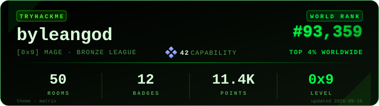

<div align="center">

# `[ HTTP/2 200 OK — TARGET COMPROMISED ]`

<!-- Dynamic Typing SVG Header -->
<a href="https://github.com/Amartya098">
  
</a>

<br/>

<!-- Profile Views & Security Badges -->
<p align="center">
  
  
  
  
</p>

</div>

---

### `byleangod@kali:~$ cat /etc/security/profile.json`

```json
{
  "operator": "Amartya",
  "handle": "ByLeanGod",
  "role": "Web Security Researcher & Bug Hunter",
  "site": "amartya.tech",
  "core_competencies": [
    "Web Application & API Penetration Testing",
    "Deep Reconnaissance & Attack Surface Mapping",
    "Business Logic & Access Control Exploitation",
    "Offensive Web Automation & Tooling"
  ],
  "mission": "Uncovering high-impact web vulnerabilities, chaining primitives, and fortifying modern web infrastructure."
}
```

---

<div align="center">

### `[ WARGAME & ARENA TELEMETRY ]`

<a href="https://tryhackme.com/p/byleangod">
  
</a>

</div>

---

### 🎯 Research Vectors & Vulnerability Scope

<table>
  <tr>
    <td width="50%" valign="top">
      <h4>🌐 Web Application Security</h4>
      <ul>
        <li><b>Access Control & IDOR:</b> Horizontal/Vertical privilege escalation</li>
        <li><b>Server-Side Flaws:</b> SSRF, Remote Code Execution (RCE), SSTI, SQLi</li>
        <li><b>Request Smuggling:</b> HTTP/1.1 & HTTP/2 desync attacks, cache poisoning</li>
        <li><b>Client-Side Attacks:</b> DOM-based XSS, CSRF, WebSockets, PostMessage exploitation</li>
      </ul>
    </td>
    <td width="50%" valign="top">
      <h4>🔍 Recon & Attack Surface Mapping</h4>
      <ul>
        <li><b>Domain Enumeration:</b> Passive & active subdomain discovery, DNS brute-forcing</li>
        <li><b>JS Analysis:</b> Endpoint extraction, hidden route discovery, secrets hunting</li>
        <li><b>Parameter Mining:</b> Hidden parameter fuzzing & reflected input tracing</li>
        <li><b>Content Discovery:</b> Deep directory busting, vhost fuzzing, archive scraping</li>
      </ul>
    </td>
  </tr>
  <tr>
    <td width="50%" valign="top">
      <h4>🔑 Auth, API & Business Logic</h4>
      <ul>
        <li><b>API Security:</b> REST, GraphQL, and microservice authorization flaws</li>
        <li><b>OAuth & SSO:</b> State tampering, redirect URI leaks, token interception</li>
        <li><b>Race Conditions:</b> Concurrency testing, limit bypasses, double-spend logic</li>
        <li><b>Payment & Workflow:</b> Logic manipulation, price tampering, step-skipping</li>
      </ul>
    </td>
    <td width="50%" valign="top">
      <h4>🚩 CTF & Vulnerability Labs</h4>
      <ul>
        <li><b>TryHackMe:</b> Top 4% Worldwide · Level 9 Mage</li>
        <li><b>PortSwigger Web Academy:</b> Advanced web security practitioner</li>
        <li><b>HackTheBox:</b> Web challenge solving & machine exploitation</li>
        <li><b>Competitive CTFs:</b> Google CTF, PicoCTF, and live web CTF tracks</li>
      </ul>
    </td>
  </tr>
</table>

---

### 🛠️ The Web Pentester's Arsenal

<div align="left">

#### `[ PROXIES & INTERCEPTION ]`
<p>
  
  
  
  
</p>

#### `[ RECON, MAPPING & FUZZING ]`
<p>
  
  
  
  
  
  
</p>

#### `[ AUTOMATION & SCRIPTING ]`
<p>
  
  
  
  
  
</p>

</div>

---

### 📡 Secure Uplink & Comms

```text
  [+] Direct Mail: Amartya2015@protonmail.com
  [+] Handle: @ByLeanGod
  [+] Web: https://amartya.tech
  [+] LinkedIn: https://linkedin.com/in/0xamartya
  [+] TryHackMe: https://tryhackme.com/p/byleangod
  [+] Focus: Bug Bounty, Web Security Assessments & Responsible Disclosure
```

<div align="center">
  <a href="mailto:Amartya2015@protonmail.com">
    
  </a>
  <a href="https://linkedin.com/in/0xamartya">
    
  </a>
  <a href="https://tryhackme.com/p/byleangod">
    
  </a>
</div>